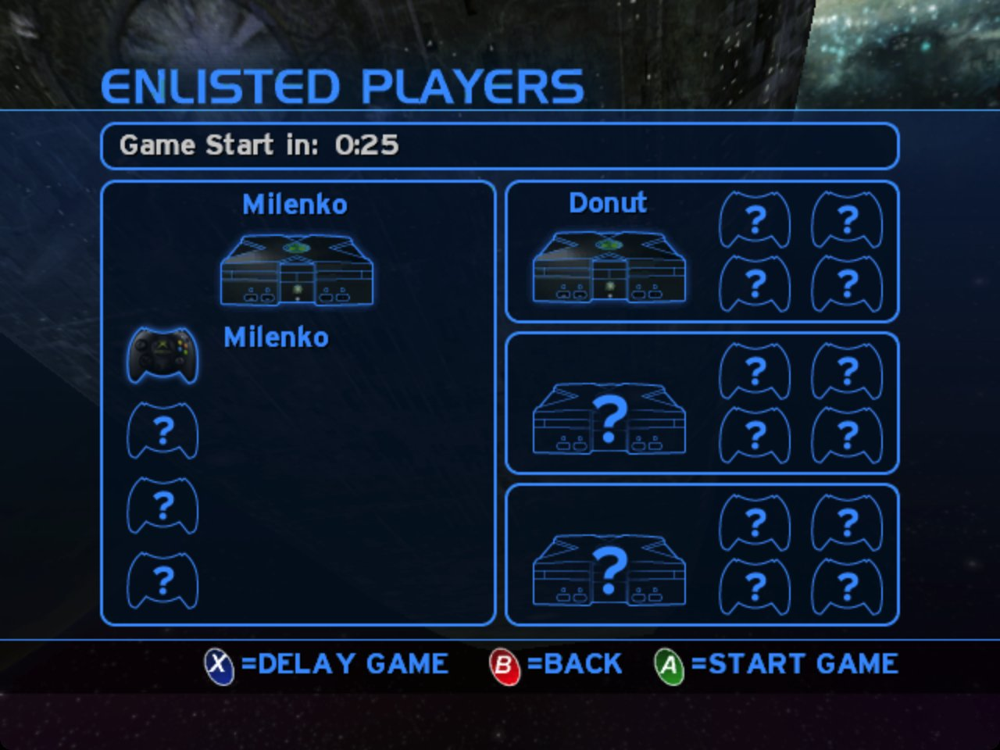

<p align="center"></p>

<h1 align="center">ChupathingyCE</h1>

<p align="center"><b>A community build of OpenCE: Halo: Combat Evolved on Windows, Mac, Linux and Android.</b></p>

<p align="center">
<a href="https://github.com/ChupathingyCE/chupathingyce/releases/latest">Download</a> ·
<a href="https://halo.milenko.org">Games online now</a> ·
<a href="https://discord.gg/4BUm2FwuCB">Discord</a>
</p>

> **Compatible with [OpenCE](https://github.com/cybersecurity/halo-ce-universal) build-76 through build-95 (network version 11).** Games hosted on older builds (network version 10) can't be joined; their hosts need to update.
> Players on OpenCE and players on ChupathingyCE play together.

ChupathingyCE is a community build of **OpenCE**, the port of the Halo: Combat
Evolved decompilation to modern computers and phones. Our goal is a unified
online experience, plus our own tweaks, on a project that's still in its
infancy. We follow OpenCE closely, send our fixes back to it, and put out our
own releases. Expect rough edges, and please report them.

<p align="center"></p>

## Features

**Online**
- **Online Games**, a server list in the Multiplayer menu: join a game with **A**, or host one with **Y**
- Games you host are listed for everyone, from any of our builds
- Invite links (`halo://join/…`) to send to friends; opening one joins their game
- Direct connections between players, with no port forwarding in most homes
- Plays with OpenCE builds of the same network version, both ways
- Dedicated servers anyone can run: a playlist of games, around the clock, with no window or player

**Stats, on [halo.milenko.org](https://halo.milenko.org)**
- A carnage report for every finished game, with medals
- Service records and leaderboards, with confirmed players (your games count toward you, whatever name you use)
- Accounts, made on the site or from the game, with an encrypted backup of your player identity
- Listing a game hosted from an OpenCE build, by its invite link

**The game**
- The campaign, split screen and System Link, running natively (no emulator)
- High-res HUD and text, and widescreen menus
- Controller prompts for Xbox, PlayStation and Nintendo pads, and the keyboard
- Updates itself: it checks for new releases when it starts, and asks first

**Platforms**

| | Windows | Mac | Linux | Android |
| --- | --- | --- | --- | --- |
| The game | Yes | Yes, Apple silicon and Intel | Yes | Yes |
| Online Games, hosting, stats | Yes | Yes | Yes | Yes |
| Dedicated server | Yes (tested in Wine) | Untested | Yes (and Docker) | |
| Updates itself | Yes | Not yet | Yes | Yes |
| Halo PC (Custom Edition) maps | 64-bit build only | Yes | Yes | Not yet |
| HaloMD maps | 64-bit build only | Yes | Yes | Not yet |
| Server Browser in the PC menus | Yes | Yes | Yes | Yes |

## Download

Get the latest release from the [Releases page](https://github.com/ChupathingyCE/chupathingyce/releases/latest):

| Platform | Download | Notes |
| --- | --- | --- |
| Windows | `chupathingyce-windows-release.zip` | Windows 10 or later. |
| Linux (64-bit) | `chupathingyce-linux64-release.zip` | Needs SDL3. See [port/linux/README.md](port/linux/README.md). |
| Linux (32-bit, older systems) | `chupathingyce-linux-release.zip` | Needs SDL3 (32-bit). See [port/linux/README.md](port/linux/README.md). |
| Android | `chupathingyce-android-release.zip` | Android 9 or later, 64-bit. See [port/android/README.md](port/android/README.md). |
| Mac | `chupathingyce-macos-release.zip` | macOS 13 or later, Apple silicon or Intel. |

The game checks for new releases when it starts and asks before updating.

We don't pay for code signing yet, so the first start needs one extra step:

- **Windows** may warn about an unknown publisher: choose **More info → Run anyway**.
- **Mac**: move ChupathingyCE to Applications and open it. If macOS won't open
  it, go to **System Settings → Privacy & Security**, and choose **Open
  Anyway** next to ChupathingyCE. You only do this once.

## You need your own copy of Halo

ChupathingyCE doesn't include the game's maps, sounds or art. You need an Xbox
disc image (`.iso` or `.xiso`) of Halo: Combat Evolved. Any region works.

1. Start ChupathingyCE.
2. The first time, it asks for your disc image. Pick it.
3. It copies the game's `maps` folder out of the image (about 2 GB), then starts.

On Android, copy the disc image to your phone first. On a Mac, the maps,
settings and saves go in `~/Library/Application Support/ChupathingyCE`.
On Linux, the maps and settings (`config.toml`) go next to the `halo`
executable, and the saves in `~/.local/share/halo-linux` (or
`$XDG_DATA_HOME/halo-linux`). The 64-bit and 32-bit builds use the same
places, so switching from one to the other keeps your saves and settings.

## Halo PC maps

ChupathingyCE also plays Halo PC (Custom Edition) multiplayer maps, on a Mac,
on Linux and in the 64-bit Windows build. Copy the `.map` files from your own Halo PC (Custom Edition)
install into a `ce` folder inside the game's `maps` folder:

| Platform | Put Halo PC maps in |
| --- | --- |
| Mac | `~/Library/Application Support/ChupathingyCE/maps/ce/` |
| Linux | `maps/ce/` next to the `halo` executable |
| Windows (64-bit) | `maps\ce\` next to `halo.exe` |

Include `bitmaps.map`, `sounds.map` and `loc.map`, which the maps share. Halo PC's
own `ui.map` adds its map names and pictures. The maps appear in the multiplayer
map list after the Xbox maps, marked HALO PC. In Online Games, a game on a Halo PC
map is badged, and it can be joined only by players who have that map: the game
says which file is missing. The Xbox maps from your disc image are still needed.
A map file named `<name>@ce.map`, as some other builds name them, is found too,
in `maps/ce/` or in `maps/`.

### HaloMD maps

ChupathingyCE also plays HaloMD's multiplayer maps (the Mac Halo community's
maps, made for Halo PC 1.0), on a Mac, on Linux and in the 64-bit Windows
build. Bring your own: download
the maps you want from HaloMD's mod list, and put their `.map` files in an
`md_maps` folder beside the game's `maps` folder:

| Platform | Put HaloMD maps in |
| --- | --- |
| Mac | `~/Library/Application Support/ChupathingyCE/md_maps/` |
| Linux | `md_maps/` next to the `halo` executable |
| Windows (64-bit) | `md_maps\` next to `halo.exe` |

They need the Halo PC (Custom Edition) files above too: `bitmaps.map`,
`sounds.map` and `loc.map` from your own Halo PC install, in `maps/ce/`. A
HaloMD map keeps Halo's own textures and sounds in those shared files, and
the game reads them from Custom Edition's copies. ChupathingyCE doesn't come
with any of these files.

The maps appear in the multiplayer map list after the Halo PC maps, marked
[MD], with their names from HaloMD's list. Online, a HaloMD map is played as
`<name>@md` (`bgplus_5@md`), badged HALOMD in Online Games, and joined only by
players who have the same map file. A HaloMD map already in `maps/ce/` still
plays, and a file named `<name>@md.map` in `md_maps/` or `maps/` is found too.

HaloMD's plug-ins aren't part of ChupathingyCE. A few maps were made for one:
the visible-object and bigger-BSP limits they raised are already raised here,
and the widescreen view is the game's own, but the maps made for gameplay
plug-ins (3rd Person, Rocket Surfing, Spartan) play without them, as plain
Halo.

## Playing online

| You want to | Do this |
| --- | --- |
| Join a game | **Multiplayer → Online Games**, pick a game, press **A**. Or press **Join** on [halo.milenko.org](https://halo.milenko.org). |
| Host a game | **Multiplayer → Online Games → Y (Create Game)**, or host from System Link as usual. Your game is listed online by itself, on halo.milenko.org and in OpenCE's in-game Server Browser (`public_lobby`/`host_public` under `[network]` in `config.toml` turn that off). |
| Invite a friend | When you host, the game copies an invite link (`halo://join/…`). Send it; opening it joins your game. |
| See your stats | Your service record is on [halo.milenko.org](https://halo.milenko.org), found by your name. Games you join count even when the host doesn't run ChupathingyCE: when an online game you joined ends, the game sends halo.milenko.org the scoreboard as your game saw it (names, kills, deaths, scores, medals, weapons) with your player ID. To turn that off, set `report_joined_games = false` under `[network]` in `config.toml`. |
| Make an account | On [halo.milenko.org/profile](https://halo.milenko.org/profile), or press **Start** in Online Games to make one for the player you already are. |
| Link the game without a browser (Steam Deck, Game Mode) | In Online Games, press **RB** (or **C** on the keyboard) for Link Profile. On your phone or computer, go to [halo.milenko.org/connect](https://halo.milenko.org/connect), enter the code the game shows (or scan its QR code), then press **A** in the game to confirm. |
| Use the PC menus | Set `menus = "pc"` under `[display]` in `config.toml`. **Multiplayer → Join Game → Server Browser** lists OpenCE's public games and the games of halo.milenko.org, each once. |
| List a game from an OpenCE build | Sign in on the site, open **Host a Game**, and paste your invite link. |

Everything here plays with OpenCE builds of the same network version: they can
join your games and you can join theirs. Games an OpenCE build hosts are
recorded from the reports of the ChupathingyCE players in them; a game only
one player reported counts only on that player's own record. Games hosted from OpenCE builds can still be listed by
their host on the site (Host a Game).

<p align="center">


</p>

## Settings (config.toml)

Most of what you can change lives in the game's menus, but everything the
port adds is in one file, `config.toml`. The game writes it the first time it
starts, with every setting listed, commented out at its default, and a line
or two saying what each one does. To change one, remove the `#` in front of it
and edit the value; the game reads the file when it starts.

| Platform | config.toml is |
| --- | --- |
| Windows | next to `halo.exe` |
| Mac | `~/Library/Application Support/ChupathingyCE/config.toml` |
| Linux and Steam Deck | next to the `halo` executable |
| Android | in the game's data folder |

A few people look for most:

| Setting | What it does |
| --- | --- |
| `display.mode` | `"fullscreen"`, `"borderless"` or `"windowed"`. F11 switches between a window and the whole screen. |
| `display.window_scale` | The window's size, as a multiple of 640x480. |
| `display.vsync`, `display.max_fps` | Vertical sync, and a frame rate cap (0 for none). |
| `display.menus` | `"xbox"` (the default) or `"pc"`, the Halo PC style menus with their Server Browser. |
| `display.player_names` | Names over players' heads: `"all"`, `"allies"`, `"enemies"` or `"none"`. |
| `audio.volume`, `audio.music_volume`, `audio.effects_volume` | Volumes, from 0.0 to 1.0. |
| `input.mouse_sensitivity`, `input.invert_mouse` | Mouse aim. |
| `controls.*` | Every key: `controls.jump = "Space"`, or two at once, such as `"F, Mouse 4"`. |
| `network.browser_url` | The game list Online Games shows (halo.milenko.org). |
| `network.host_public` | Whether games you host are listed for everyone (true) or only joinable by invite (false). |
| `update.auto` | Whether the game updates itself. |
| `paths.data`, `paths.saves` | Where the maps and the saves are, if not the usual place. |

Settings you leave at their default follow each new version's default, so
leaving the file alone is always safe. Every setting can also be given as an
environment variable for one run (the file lists each one's name), which
overrides the file.

## Run a server

A dedicated server is a copy of the game with no player and no window, hosting
a playlist of games and listing them on halo.milenko.org and in Online Games.
You can run one on your own computer, with no port forwarding:
[the setup guide](docs/dedicated-server.md) walks through it. For one that runs
around the clock on a Linux server, see [server/README.md](server/README.md).

## How ChupathingyCE relates to OpenCE

- OpenCE ([cybersecurity/halo-ce-universal](https://github.com/cybersecurity/halo-ce-universal))
  is where the port is made. ChupathingyCE merges its changes regularly.
- We keep the same network version, so players of both play together. The line
  at the top of this page says which OpenCE builds match this one.
- Fixes to the shared game code go back to OpenCE as pull requests.
- ChupathingyCE has its own version numbers (this is v0.5.0b) and its own
  releases, so it doesn't change under you every few hours.

## Building it yourself

You need Python 3, [ninja](https://ninja-build.org/) and clang. The game
supplies the Xbox SDK declarations it uses, so you don't need the SDK.

```sh
python3 configure.py
ninja            # the game for the computer you're on
```

| Target | Result | Instructions |
| --- | --- | --- |
| `ninja macos` | `build/macos/ChupathingyCE.app` | [port/macos/README.md](port/macos/README.md) |
| `ninja linux64` | `build/linux64/halo` (64-bit) | [port/linux/README.md](port/linux/README.md) |
| `ninja linux` | `build/linux/halo` (32-bit) | [port/linux/README.md](port/linux/README.md) |
| `ninja windows` | `build/windows/halo.exe` | [port/windows/README.md](port/windows/README.md) |
| `ninja windows64` | `build/windows64/halo.exe`, the 64-bit game | [port/windows/README.md](port/windows/README.md#64-bit) |
| `ninja android_apk` | the Android app | [port/android/README.md](port/android/README.md) |

Useful `configure.py` options:

| Option | What it does |
| --- | --- |
| `--release` | A release build, as players get. Without it, a failed check stops the game. |
| `--portable` | A Linux or Windows build that runs on any x86-64 computer, to give to others. |
| `--no-game-browser` | Leaves out the server list, stats and dedicated servers, as OpenCE's builds are. |
| `--pgo=off`, `--lto=off` | Faster builds, without profile-guided or link-time optimisation. |

The version being made is in `VERSION`. Releases are built and published by
the project's release workflow; the builds on this repository's Actions page
are for checking changes.

## Credits

- The decompilation: [punpckhdq/halo](https://github.com/punpckhdq/halo) and
  [bnunu/halo-1](https://github.com/bnunu/halo-1), of the Xbox build 2342.
- The port: [OpenCE](https://github.com/cybersecurity/halo-ce-universal) and
  its contributors.
- ChupathingyCE: [Milenko](https://github.com/MrMilenko) and contributors. The
  icon is MrBruh's helmet, with tusks.
- Fonts: [Noto Sans](https://fonts.google.com/noto) (SIL OFL) and
  [Kenney's Input Prompts](https://kenney.nl/assets/input-prompts) (CC0).
- HaloMD map names: from [MacGamingMods](https://macgamingmods.com)' public
  HaloMD mod list, so the menus can show each map's own name.
- Libraries: SDL3, stb, Mbed TLS, miniupnpc, KCP, tomlc17, musl's maths,
  extract-xiso, and Project Nayuki's QR Code generator. Their licenses are
  beside them in `port/third_party`.

### Contributors

Fixes from other people's OpenCE pull requests and forks, taken into
ChupathingyCE with their authors credited in each commit. What OpenCE has
merged itself, such as MrBruh's work, comes with OpenCE and is credited
there.

- [Tyberious](https://github.com/Tyberious) (Jeff Clark): Xbox ADPCM decoding
  without the 344 Hz buzz, vertex constant serials that never wrap, pose
  snapping for frame interpolation, and the clip-space position kept on the
  desktop (no more first-person vertex spikes).
- [thelinkin3000](https://github.com/thelinkin3000): the motion sensor for
  three and four local players (a split screen crash), and split screen
  dividers where the views meet on a wide screen.
- [xshxdex98](https://github.com/xshxdex98) ([DamnationCE](https://github.com/xshxdex98/DamnationCE)):
  the pause menu's QUIT by mouse or keyboard, and lens flares out of view no
  longer tested.
- [zimm3rmann](https://github.com/zimm3rmann): visibility test slot 0 kept
  apart from the scratch query (lens flares sharing a result).
- [nsafran1217](https://github.com/nsafran1217) (Nathan Safran): no hang
  where the visibility results buffer cannot be mapped.
- [saulob](https://github.com/saulob): the first menu frame's colors.
- [natsu-anon](https://github.com/natsu-anon): the cursor hidden during play.
- [lantos1618](https://github.com/lantos1618): no ghosting in the zoom effect
  at high resolutions; on macOS, Command-W does not quit and Command-Q asks
  twice.
- [pfista](https://github.com/pfista) (Michael Pfister): projectile trails
  ready before a weapon's first shot.
- [JoshRob297](https://github.com/JoshRob297): hosts that run their own games
  (the dedicated servers) no longer refuse every join after one arrived as a
  game ended.

Halo is a trademark of Microsoft. ChupathingyCE is a fan project, not made or
endorsed by Microsoft, Bungie or 343 Industries, and includes none of the
game's content. The code is released under [CC0](LICENSE.md).
